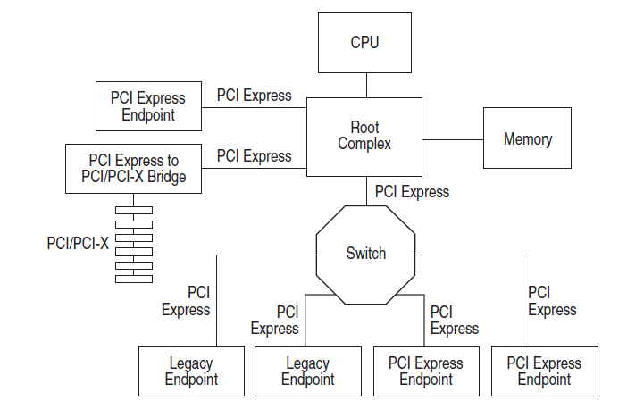

## Linux Kernel PCIe Initialization Procedure

### PCIe Overview

PCIe as is PCI Express, PCIe is a high performance, general purpose I/O interconnect defined for a wide variety of future computing and communication platforms. 

#### PCIe Fabric Topology 

A fabric is composed of point-to-point Links that interconnect a set of components – an example
fabric topology is shown in Figure 1-2. This figure illustrates a single fabric instance referred to as a
hierarchy – composed of a Root Complex (RC), multiple Endpoints (I/O devices), a Switch, and a
PCI Express to PCI/PCI-X Bridge, all interconnected via PCI Express Links.



#### PCIe device probe flow

PCIe RC driver code is different implementation due to different vendor, but all them under folder drivers/pci/dwc.

The following is Qualcomm PCIe RC driver for ARM.

***pcie-qcom.c***

```c
static const struct of_device_id qcom_pcie_match[] = {
	{ .compatible = "qcom,pcie-apq8084", .data = &ops_1_0_0 },
	{ .compatible = "qcom,pcie-ipq8064", .data = &ops_2_1_0 },
	{ .compatible = "qcom,pcie-apq8064", .data = &ops_2_1_0 },
	{ .compatible = "qcom,pcie-msm8996", .data = &ops_2_3_2 },
	{ .compatible = "qcom,pcie-ipq8074", .data = &ops_2_3_3 },
	{ .compatible = "qcom,pcie-ipq4019", .data = &ops_2_4_0 },
	{ }
};

static struct platform_driver qcom_pcie_driver = {
	.probe = qcom_pcie_probe,
	.driver = {
		.name = "qcom-pcie",
		.suppress_bind_attrs = true,
		.of_match_table = qcom_pcie_match,
	},
};
builtin_platform_driver(qcom_pcie_driver);
```

***platform_device.h***

```c
/* builtin_platform_driver() - Helper macro for builtin drivers that
 * don't do anything special in driver init.  This eliminates some
 * boilerplate.  Each driver may only use this macro once, and
 * calling it replaces device_initcall().  Note this is meant to be
 * a parallel of module_platform_driver() above, but w/o _exit stuff.
 */
#define builtin_platform_driver(__platform_driver) \
	builtin_driver(__platform_driver, platform_driver_register)

/*
 * use a macro to avoid include chaining to get THIS_MODULE
 */
#define platform_driver_register(drv) \
	__platform_driver_register(drv, THIS_MODULE)
```

platform.c

```c
/**
 * __platform_driver_register - register a driver for platform-level devices
 * @drv: platform driver structure
 * @owner: owning module/driver
 */
int __platform_driver_register(struct platform_driver *drv,
				struct module *owner)
{
	drv->driver.owner = owner;
	drv->driver.bus = &platform_bus_type;
	drv->driver.probe = platform_drv_probe;
	drv->driver.remove = platform_drv_remove;
	drv->driver.shutdown = platform_drv_shutdown;

	return driver_register(&drv->driver);
}
EXPORT_SYMBOL_GPL(__platform_driver_register);
```

Updating not complete...............

[Back to Home](../index.md)